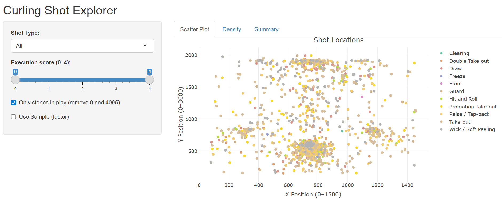
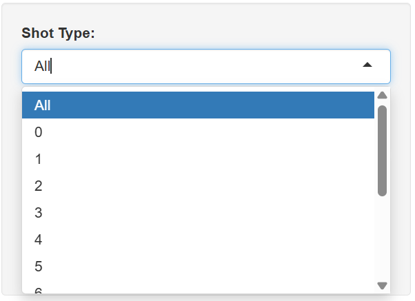
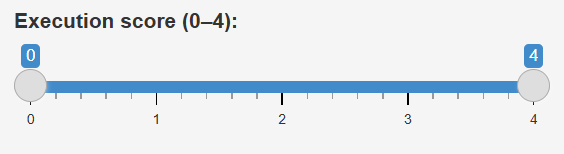
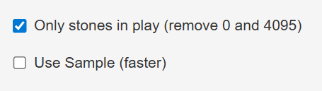
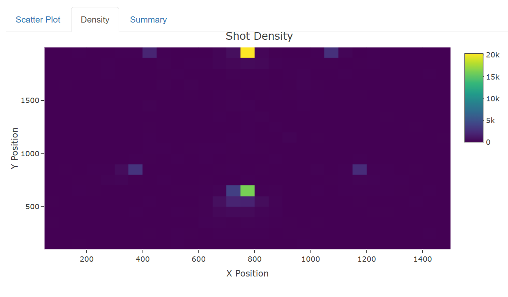
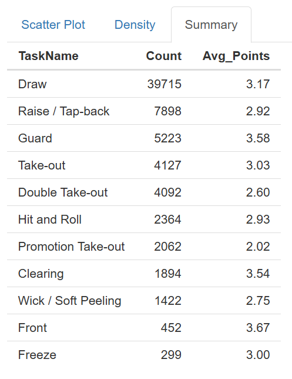

```{r setup, include=TRUE}
knitr::opts_chunk$set(echo = TRUE)
library(tidyverse)
library(shiny)
library(plotly)
```

## Welcome

* This workshop is a part of [Connecticut Sports Analytics Symposium (CSAS) 2026](https://statds.org/events/csas2026/index.html).

* This workshop aims to give a quick tour of R Shiny.

* All source codes of related documents of this workshop are in the GitHub repository: <https://github.com/statlucy/CSAS2026_intro_to_interactive_visualization>.

## About me

* 3nd Year Statistics and Applied Mathematics Student at UConn

* President of UConn Joint Statistical Club

* Interests: Cluster analysis, Dimensional reduction methods, Autoregressive modeling

## Prerequisites

* A laptop with R/RStudio installed
    * R can be downloaded for windows users [here](https://cran.r-project.org/bin/windows/base/) and for Mac users [here](https://cran.r-project.org/bin/macosx/).
    * RStudio can be downloaded for all users [here](https://www.rstudio.com/products/rstudio/download/).
* Basic familiarity with R is recommended, but no prior experience with Shiny or Plotly is required

## Outline

* Interactive visualization concepts
* Plotly basics
* R Shiny basics
* Curling dataset exploration

## What is Interactive Visualization?

* Allows user interaction with plots
* Immediate visual feedback

## Why use it?

* Static plots can only show predefined views of data.
* Interactive visualization allows exploration from multiple angles.
* Helps uncover hidden patterns, outliers, and trends.
* Encourages hands-on data analysis and deeper understanding.
* Especially useful in large or complex datasets where filtering and zooming matter.
* Allows other people who are not necessarily familiar with coding to explore data

## What are some types of interaction?

## What is Plotly?
* Plotly is an R library for interactive graphics.
* Converts static R plots into dynamic, interactive visualizations.
* Supports multiple types of plots:
* Scatter, line, bar, box, heatmaps, 3D plots, etc.
* Works seamlessly with Shiny to create dashboards.

## Why use Plotly?
* Adds hover information, zooming, panning, and selection.
* Simplifies interactive dashboards without extensive JavaScript coding.
* Compatible with R, Python, and JavaScript, making plots shareable across platforms.
* Integrates easily with ggplot2 via ggplotly().
* Ideal for data exploration, presentations, and storytelling.

## Plotly Features
* Hover tooltips – display additional data when hovering over points.
* Zoom and pan – focus on regions of interest.
* Legend interactivity – click legend items to hide/show series.
* Multiple plot types – scatter, bar, histogram, box, heatmap, 3D, polar, choropleth, and more.
* Export & share – download plots as images or share online dashboards.

## Let's see an example!

## Load data
```{r}
stones <- read_csv("Stones.csv")
teams  <- read_csv("Teams.csv")
```

## Inspect data
```{r}
glimpse(stones)
summary(stones)
```

## Key variables
```{r}
names(stones)
names(teams)
```
## Join data
```{r}
stones <- read_csv("Stones.csv")
teams  <- read_csv("Teams.csv")

data <- left_join(stones, teams, by = "TeamID")
```


## Shot type
```{r}
table(data$Task)
```

## Basic Scatter Plot
```{r}
plot(data$stone_1_x, data$stone_1_y)
```

## ggplot version
```{r}
ggplot(stones, aes(stone_1_x, stone_1_y)) +
  geom_point() +
  labs(title = "Stone Positions")
```

## Plot Limitations
* Static
* No interaction

## Plotly
```{r}
library(plotly)
```

## Plotly Scatter
```{r}
plot_ly(data %>% filter(Task == 0), x = ~stone_1_x, y = ~stone_1_y,
        type = "scatter", mode = "markers")
```

## Add Hover
```{r}
plot_ly(data %>% filter(Task == 0),
        x = ~stone_1_x,
        y = ~stone_1_y,
        text = ~Task,
        mode = "markers")
```

## Add more features
```{r}
plot_ly(data,
        x = ~stone_1_x,
        y = ~stone_1_y,
        color = ~factor(Task),
        text = ~paste("Points:", Points, "<br>Player:", PlayerID),
        mode = "markers") 
```

## Plotly Features Demonstrated
* Hover shows Points and PlayerID.
* Click and drag to zoom in/out.
* Use legends to filter tasks interactively.

## What is a Density Plot?
* A density plot shows how data is distributed across space.
* Instead of plotting individual points, it shows where points are concentrated.
* In 2D:
  * Darker / more intense colors = more observations
  * Lighter colors = fewer observations
  
## Why Use a Density Plot?
* Scatter plots can become overcrowded with large datasets.
* Hard to see patterns when many points overlap.
* A density plot helps us:
  * Identify clusters of points
  * Detect hotspots (frequent shot locations)
  * Understand overall spatial patterns
  * Reduce visual clutter

## Density Plot in Our App
* We use a 2D histogram to create the density plot.
* The ice surface is divided into bins (grid cells).
* Each bin counts how many shots fall inside it.
Then:
* Color intensity represents shot frequency
* Higher count = darker color

## Density Plot using Plotly
```{r}
plot_ly(
  data %>% filter(Task == 0), x = ~stone_1_x, y = ~stone_1_y,
  type = "histogram2d", nbinsx = 30, nbinsy = 30
) %>%
  layout(
    title = "Shot Density: Draw",
    xaxis = list(title = "X Position"),
    yaxis = list(title = "Y Position"),
    coloraxis = list(colorbar = list(title = "Count"))
  )
```
## Density Plot Parameters
* type = "histogram2d"
  * Creates a 2D density heatmap
* nbinsx, nbinsy
  * Controls how many grid cells we divide the space into
  * Fewer bins → smoother, less cluttered plot
  * More bins → more detail but can be noisy
* colorbar
  * Shows the number of shots per bin

## Interpreting Density Plot
* Dark regions = frequent shot locations
* Light regions = rare shot locations
* Empty areas = no shots taken
In curling:
* You can identify common strategies
* See where players prefer to place stones

## What is an R Shiny App?

* R Shiny is a **framework to build interactive web applications in R**.
* Allows you to turn **R analyses and plots** into interactive tools.
* Users can **manipulate inputs** (filters, sliders, selectors) and see plots update in real time.
* Shiny apps can be deployed on the web or shared locally.


## Why Make a Shiny App?

* Makes data exploration **dynamic and interactive**.
* Allows users to **experiment with scenarios** without modifying code.
* Ideal for **dashboards, data reporting, teaching, and analysis sharing**.
* Enhances **visual storytelling** with interactive plots.


## Components of a Shiny App

1. **UI (User Interface)** – Defines **layout and input/output elements**.
    - e.g., sliders, dropdowns, checkboxes, tables, plots
2. **Server** – Defines the **logic behind inputs and outputs**.
    - e.g., filtering data, generating plots dynamically
3. **Reactive expressions** – Automatically update outputs when inputs change
4. **App launcher** – Combines UI and server with `shinyApp(ui, server)`


## Shiny App Workflow

1. User interacts with an input (e.g., slider, selector)
2. Reactive expressions detect changes
3. Server recalculates outputs (plots, tables)
4. Updated outputs render in the UI immediately


## Example: Simple Shiny App Structure

```{r, eval=FALSE}
ui <- fluidPage(
  titlePanel("My First Shiny App"),
  sidebarLayout(
    sidebarPanel(
      sliderInput("num", "Choose a number:", 1, 100, 50)
    ),
    mainPanel(
      textOutput("result")
    )
  )
)

server <- function(input, output) {
  output$result <- renderText({
    paste("You selected", input$num)
  })
}

shinyApp(ui, server)

```

## fluidPage()
* The main container for your Shiny app UI.
* Arranges all UI elements in a single web page.
* Can contain layouts, panels, inputs, outputs, and custom HTML.
```{r, eval = FALSE}
ui <- fluidPage(
  titlePanel("Example App"),
  sidebarLayout(
    sidebarPanel(),
    mainPanel()
  )
)
```
* All other UI elements live inside fluidPage()

## titlePanel()
* Displays a title at the top of the page.
* Can include text or even small HTML styling.
```{r, eval = FALSE}
titlePanel("Curling Shot Explorer")
```
* Often paired with fluidPage() to provide context immediately.

## sidebarLayout()
* Organizes the page into a sidebar and main area.
* Typically used for inputs in the sidebar and outputs in the main panel.
```{r, eval = FALSE}
sidebarLayout(
  sidebarPanel(),
  mainPanel()
)
```
* Ensures a clean, standard dashboard look.

## sidebarPanel()
* Contains user input elements like sliders, selectors, checkboxes, etc.
* All inputs inside sidebarPanel() become reactive variables in the server.

```{r, eval = FALSE}
sidebarPanel(
  sliderInput("num", "Choose a number:", 1, 100, 50),
  selectInput("task", "Shot Type:", choices = c("All", task_labels))
)
```

## Where is it?



## mainPanel()
* Contains outputs like plots, tables, or text.
* Works with reactive expressions to display results instantly.
```{r, eval=FALSE}
mainPanel(
  plotlyOutput("scatter"),
  tableOutput("summary")
)
```
* Often complements sidebarPanel() in sidebarLayout().

## selectInput()
* Provides a dropdown menu for users to select a value.
* Returns the selected value as input$<id> in the server.
```{r, eval=FALSE}
selectInput("task", "Shot Type:", choices = c("All", task_labels), selected = "All")
```
* Useful for categorical filters.


## sliderInput()
* Lets users pick a numeric value or range with a slider.
* Returns input$<id> as a number or numeric vector.
```{r, eval = FALSE}
sliderInput("points", "Points to Display:", min = 0, max = 4, value = c(0, 4))
```
* Supports single values or ranges (value = c(min, max)).


## checkboxInput()
* Lets users choose TRUE/FALSE options.
* Returns a logical value in the server.
```{r, eval = FALSE}
checkboxInput("in_play", "Only stones in play", value = TRUE)
```
* Great for toggles like sampling or filtering.


## tabsetPanel() and tabPanel()
* Organize multiple outputs in tabs.
* Each tab can contain plots, tables, or other UI elements.
```{r, eval=FALSE}
tabsetPanel(
  tabPanel("Scatter Plot", plotlyOutput("scatter")),
  tabPanel("Density", plotlyOutput("density")),
  tabPanel("Summary", tableOutput("summary"))
)
```
* Helps keep UI clean when showing multiple visualizations.

## What does this look like?


## Reactive Elements in Shiny
* Reactive elements automatically update when inputs change.
* Examples of reactive elements:
  * reactive() – for filtered or processed data
  * renderPlot(), renderPlotly(), renderTable() – for outputs
* Shiny tracks dependencies and only recalculates when needed.

## How Reactive Expressions Work
1. Wrap data transformations in reactive({ ... }).
2. Return the processed object inside the block.
3. Access the reactive object in outputs using filtered().
4. Shiny invalidates and recalculates filtered() whenever inputs change.
```{r, eval = FALSE}
filtered <- reactive({
  df <- data
  if (input$task != "All") {
    df <- df %>% filter(Task == input$task)
  }
  df <- df %>% filter(Points >= input$points[1], Points <= input$points[2])
  df
})
```

## Reactive vs Non-Reactive

| Reactive | Non-Reactive |
|-------------|:-------------:|
| Updates automatically when input changes | Stays static unless manually recalculated |
| Use reactive() and render*() | Direct R objects or plot() calls |

## Using Reactive in Outputs
* In Shiny, outputs always depend on reactive objects to remain dynamic.
```{r, eval = FALSE}
output$scatter <- renderPlotly({
  plot_ly(filtered(),
          x = ~stone_1_x,
          y = ~stone_1_y,
          color = ~TaskName,
          mode = "markers")
})
```
* filtered() is reactive – updates automatically.
* Plot updates immediately when slider, checkbox, or selector changes.

## Reactive Flow
1. User Input (slider, selectInput, checkbox)
2. Reactive Expression (filtered())
3. Output Renderer (renderPlotly, renderTable)
4. Updated Plot/Table on UI

Shiny automatically manages dependencies and updates only affected outputs.

## Integrating Plotly with Shiny
* Plotly plots are reactive in Shiny apps.
* Inputs like sliders, selectors, and checkboxes dynamically update plots.
* Users can explore different subsets of data without writing R code.

## R Shiny Demo
Let's create an R Shiny App to explore our curling data.

## Load data
```{r}
stones <- read_csv("Stones.csv")
teams  <- read_csv("Teams.csv")

data <- left_join(stones, teams, by = "TeamID")
```

## Define Task Labels
We create a lookup table for shot types.
```{r}
task_labels <- c(
  "0" = "Draw",
  "1" = "Front",
  "2" = "Guard",
  "3" = "Raise / Tap-back",
  "4" = "Wick / Soft Peeling",
  "5" = "Freeze",
  "6" = "Take-out",
  "7" = "Hit and Roll",
  "8" = "Clearing",
  "9" = "Double Take-out",
  "10" = "Promotion Take-out",
  "11" = "Through",
  "13" = "No statistics"
)
```
This helps convert numeric task codes to descriptive names.

## Build the UI
Shiny apps have a user interface (UI)
```{r, eval = FALSE}
ui <- fluidPage(
  titlePanel("Curling Shot Explorer"),
  sidebarLayout(
    sidebarPanel(
      selectInput("task", "Shot Type:", choices = c("All", task_labels), selected = "All"),
      sliderInput("points", "Execution score (0–4):", min = 0, max = 4, value = c(0,4), step = 1),
      checkboxInput("in_play", "Only stones in play", value = TRUE),
      checkboxInput("sample", "Use Sample (faster)", value = FALSE)
    ),
    mainPanel(
      tabsetPanel(
        tabPanel("Scatter Plot", plotlyOutput("scatter")),
        tabPanel("Density", plotlyOutput("density")),
        tabPanel("Summary", tableOutput("summary"))
      )
    )
  )
)
```
* fluidPage() - main layout container
* sidebarPanel() - user inputs
* mainPanel() - outputs: scatter, density, summary
* tabsetPanel() - multiple tabs in one page

## Server Logic
* The server defines how the app responds to user input.
* reactive() recalculates filtered data when inputs change
Filters by:
* Shot type (TaskName)
* Points range
* Stone positions
* Optional sampling
Adds TaskName column for descriptive labels

## Server Example
```{r, eval = FALSE}
server <- function(input, output) {

  filtered <- reactive({
    df <- data

    if (input$task != "All") {
      df <- df %>% filter(Task == as.numeric(names(task_labels)[task_labels == input$task]))
    }

    df <- df %>% filter(Points >= input$points[1], Points <= input$points[2])

    if (input$in_play) {
      df <- df %>% filter(stone_1_x > 0, stone_1_x < 4095,
                          stone_1_y > 0, stone_1_y < 4095)
    }

    if (input$sample && nrow(df) > 5000) {
      df <- sample_n(df, 5000)
    }

    df <- df %>% mutate(TaskName = task_labels[as.character(Task)])

    validate(need(nrow(df) > 0, "No data for selected filters"))
    df
  })
```
* we filter by task, points, stone positions, and sample size

## Scatter Plot Output
```{r, eval = FALSE}
output$scatter <- renderPlotly({
  plot_ly(filtered(),
          x = ~stone_1_x,
          y = ~stone_1_y,
          color = ~TaskName,
          text = ~paste("Points:", Points,
                        "<br>Player:", PlayerID,
                        "<br>Team:", TeamID,
                        "<br>Shot Type:", TaskName),
          mode = "markers") %>%
    layout(title = "Shot Locations",
           xaxis = list(title = "X Position"),
           yaxis = list(title = "Y Position"))
})
```
* Uses the filtered data
* Hover text shows additional info
* mode = "markers" creates scatter points

## Scatter Plot in App


## Density Plot Output
Render a 2D histogram (density plot):
```{r, eval = FALSE}
output$density <- renderPlotly({
  plot_ly(filtered(),
          x = ~stone_1_x,
          y = ~stone_1_y,
          type = "histogram2d",
          nbinsx = 30,
          nbinsy = 30) %>%
    layout(title = "Shot Density",
           xaxis = list(title = "X Position"),
           yaxis = list(title = "Y Position"),
           coloraxis = list(colorbar = list(title = "Count")))
})
```
* shows concentration of shots on the sheet
* Hover text automatically shows x/y values

## Density plot in App



## Summary Table Output
Render a summary table:
```{r, eval = FALSE}
output$summary <- renderTable({
  filtered() %>%
    group_by(Task) %>%
    summarise(
      Count = n(),
      Avg_Points = round(mean(Points, na.rm = TRUE), 2)
    ) %>%
    arrange(desc(Count))
})
```
* Shows shot counts and average points by name

## Summary Table in App


## Launch the App
Finally, we run the app:
```{r, eval=FALSE}
shinyApp(ui, server)
```
* this starts the Shiny server in RStudio or your browser
* All inputs, filters, and plots are now interactive

## Recap
```{r}
library(shiny)
library(plotly)
```
* R Shiny = app
* Plotly = interaction

## Summary
* Reactive programming in Shiny updates outputs automatically
* Plotly makes plots interactive (hover, zoom, pan)
* Filtering data dynamically lets users explore subsets
* Tabsets organize multiple outputs in one dashboard

## References
[2026 CSAS Intro to Interactive Visualization (this workshop)](https://github.com/statlucy/CSAS2026_intro_to_interactive_visualization)

[2025 CSAS Intro to R Workshop](https://github.com/statlucy/CSAS2025_intro_to_R)

[Shiny Posit](https://shiny.posit.co)

[ggplot2 book](https://ggplot2-book.org/)
